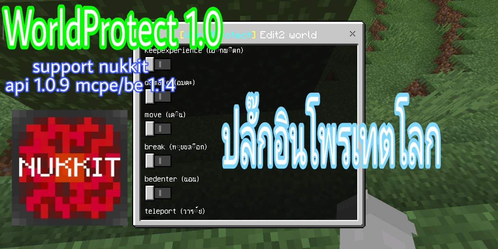

**คุณสมบัติของปลั๊กอิน** 
- เป็นปลั๊กอินโพรเทตโลกโดยใช้อีเว้นท์ต่างๆ
- โดยอีเว้นท์ทั้งหมด 22 อีเว้นท์
- place (วางบล็อก)
- break (ทุบบล็อก)
- interact (แตะบล็อก)
- damage (อมตะ)
- pvp (ต่อสู่)
- explode (ระเบิดบล็อกกระจาย)
- weather (ฝนตก)
- item-drop (ทิ้งไอเทม)
- move (เดิน)
- fly (บิน)
- keepinventory (ของตก)
- keepexperience (เอ็กพีตก)
- bucketfill (เทถัง)
- bucketempty (ตักถัง)
- chat (แชท)
- bedenter (นอน)
- eatfood (กินอาหาร)
- food (หลอดอาหาร)
- teleport (วาร์ป)
- itemframe-drop (ไอเทมโชว์ตก)
- banitem (แบนไอเทม)
- bancmd (แบนคำสั่ง)

**วิธีใช้งาน** 
- เวอร์ชั่น 1.0 คลิปตัวอย่าง [คลิก](https://youtu.be/)

## ดาวโหลด
| version  | plugin support                        | Download  zip/phar                                                 |
| ---- | ------------------------------------ | ---------------------------------------------------------- |
| 1.0  | nukkit api 1.0.9 mcpe 1.14 [Click here](https://github.com/NukkitX/Nukkit) | [คลิก](https://github.com/HmmHmmmm/WorldProtect/releases/1.0) |

**Command** 
- /worldprotect : เปิด gui form
- /worldprotect info : เครดิตผู้สร้างปลั๊กอิน
- /worldprotect event : ดูอีเว้นท์ต่างๆ
- /worldprotect set <worldname> <event> <true:false> : โพรเทตต่างๆ
- /worldprotect banitem <worldname> <id:damage> : แบนไอเทม
- /worldprotect unbanitem <worldname> <id:damage> : ปลดแบนไอเทม
- /worldprotect bancmd <worldname> <command> : แบนคำสั่ง
- /worldprotect unbancmd <worldname> <command> : ปลดแบนคำสั่ง
- /worldprotect whitelist <playerName> : อนุญาตให้ผู้เล่นใช้อีเว้นท์ต่างๆ
- /worldprotect unwhitelist <playerName> : ปลดผู้เล่นไม่ให้ใช้อีเว้นท์ต่างๆ